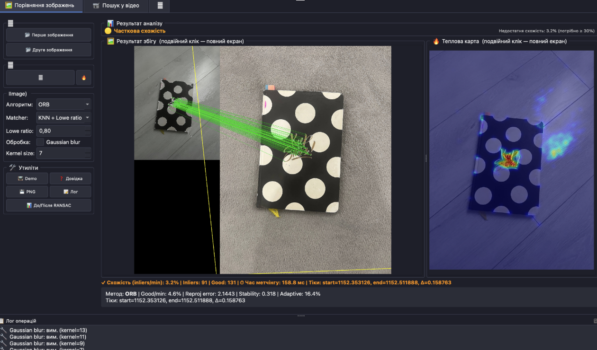
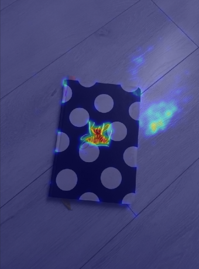
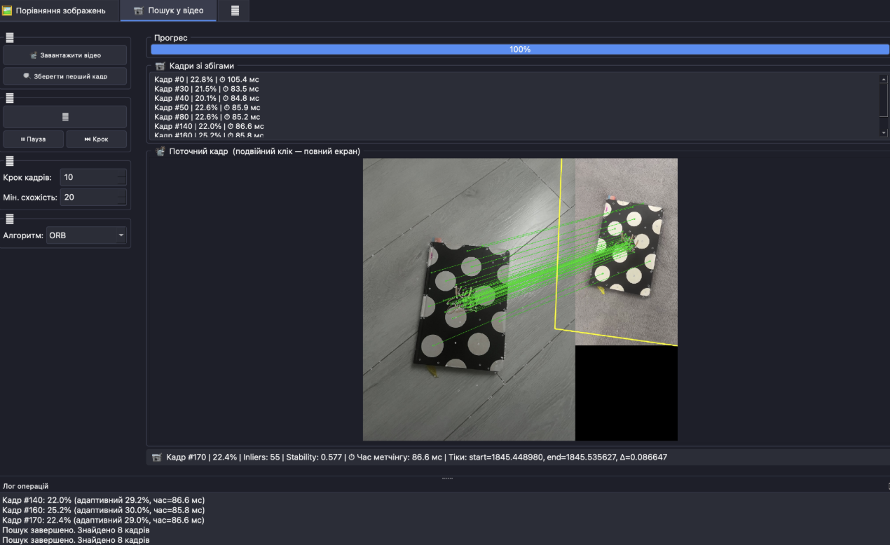

# 📘 Feature Matcher Studio

> Десктопний застосунок для пошуку однакових об'єктів на зображеннях та у відео за допомогою класичних методів комп'ютерного зору (ORB, AKAZE, SIFT, RANSAC).

---

## 👤 Автор

- **ПІБ**: Кравчишин Максим
- **Група**: ФеП-42
- **Керівник**: Русиняк Михайло Омелянович 
- **Дата виконання**: 21.05.2026

---

## 📌 Загальна інформація

- **Тип проєкту**: Десктопний застосунок
- **Мова програмування**: Python 3.7+
- **Фреймворки / Бібліотеки**: PyQt5, OpenCV, NumPy

---

## 🧠 Опис функціоналу

- 🖼️ Порівняння двох зображень із визначенням відповідностей між ключовими точками
- 🎯 Локалізація об'єкта через гомографію (RANSAC) та виділення рамкою
- 🔍 Три алгоритми детекції ознак: **ORB**, **AKAZE**, **SIFT** (Strategy pattern)
- 🤝 Два режими матчингу: **KNN + Lowe ratio** та **BFMatcher crossCheck**
- 📊 Метрики схожості: інлайєри/min(kp), збіги/min(kp), reprojection error, stability, адаптивний поріг
- 🌡️ Теплова карта щільності ключових точок
- 🎬 Пошук об'єкта у відео з таймлайном знайдених кадрів, паузою та прогрес-баром
- 🔄 Автоматичний резервний режим: SIFT+FLANN → template matching (CLAHE / Canny)
- ⚙️ Попередня обробка: Gaussian blur, CLAHE, Canny edge detection
- 🌙 Темна тема, зум/панорамування зображень, лог у док-панелі

---

## 🧱 Опис основних класів / файлів

| Файл / Клас | Призначення |
|---|---|
| `main.py` | Точка входу: ініціалізує QApplication, HiDPI, тему Fusion |
| `ui/main_window.py` | Головне вікно з трьома вкладками та логікою UI |
| `ui/image_viewer.py` | Перегляд зображень із зумом і панорамуванням |
| `vision/feature_strategies.py` | Strategy pattern для ORB / AKAZE / SIFT детекторів |
| `vision/matcher.py` | Детекція, матчинг, гомографія, метрики, теплова карта |
| `vision/video_processor.py` | Покадрова обробка відео, пауза/стоп, адаптивний поріг |

---

## ▶️ Як запустити проєкт "з нуля"

### 1. Вимоги до системи

- Python 3.7+
- Windows / macOS / Linux
- ~500 МБ вільного місця

### 2. Клонування репозиторію

```bash
git clone https://github.com/s7imKa/diploma.git
cd diploma
```

### 3. Створення віртуального середовища (рекомендовано)

```bash
# macOS / Linux
python3 -m venv venv
source venv/bin/activate

# Windows
python -m venv venv
venv\Scripts\activate
```

### 4. Встановлення залежностей

```bash
python3 -m pip install --upgrade pip
python3 -m pip install -r requirements.txt
```

Встановлює:
- **PyQt5** — графічний інтерфейс
- **opencv-python** — комп'ютерний зір
- **numpy** — числові обчислення

### 5. Запуск

```bash
python3 main.py
```

---

## 🖱️ Інструкція для користувача

### 🖼️ Вкладка 1: Порівняння зображень

1. Натисніть **📂 Перше зображення** — завантажте еталон (об'єкт для пошуку)
2. Натисніть **📂 Друге зображення** — завантажте сцену/фото для аналізу
3. У **⚙️ Налаштуваннях** оберіть алгоритм (ORB / AKAZE / SIFT) та режим матчингу
4. Натисніть **▶️ Порівняти** — у центрі з'являться лінії збігів та рамка об'єкта
5. Внизу відображаються метрики та теплова карта ключових точок

**Результат:**
- 🟢 **Обʼєкт знайдено** — стабільна гомографія, схожість ≥ 30%, інлайєри ≥ 8
- 🟡 **Часткова схожість** — збіги є, але гомографія нестабільна
- 🔴 **Обʼєкт не знайдено** — недостатньо збігів

### 📹 Вкладка 2: Пошук у відео

1. Натисніть **📂 Перше зображення** — завантажте еталонне зображення об'єкта
2. Натисніть **🎬 Завантажити відео** — оберіть відеофайл
3. Налаштуйте **Кожні N кадрів** (крок обробки) та поріг схожості
4. Натисніть **▶️ Запустити пошук** — кадри зі збігами з'являться на таймлайні
5. Використовуйте **⏸️ Пауза / ▶️ Продовжити** або **⏹️ Стоп** для управління

### ⚙️ Вкладка 3: Навігація

- Опис метрик, порад та рекомендованих налаштувань для різних сценаріїв

---

## 📐 Метрики схожості

| Метрика | Опис |
|---|---|
| `similarity` | Інлайєри / min(kp) × 100% — основна метрика |
| `similarity_good` | Хороші збіги / min(kp) × 100% |
| `reprojection_error` | Середня похибка проєкції інлайєрів (пікселі) |
| `stability` | 1 / (1 + reprojection_error) |
| `adaptive_threshold` | Адаптивний поріг на основі статистики збігів [5, 90] |
| `inliers` | Кількість збігів після RANSAC фільтрації |

---

## 🏗️ Архітектура

```
diploma/
├── main.py                    ← Точка входу
├── requirements.txt           ← Залежності
├── ui/
│   ├── main_window.py         ← Головне вікно (3 вкладки)
│   └── image_viewer.py        ← Зум / панорамування
└── vision/
    ├── feature_strategies.py  ← Strategy: ORB / AKAZE / SIFT
    ├── matcher.py             ← ImageMatcher + MatchResult
    └── video_processor.py     ← VideoProcessor
```

**Патерн Strategy** (`feature_strategies.py`) дозволяє перемикати алгоритми детекції без зміни коду матчера.

---

## 🧪 Проблеми і рішення

| Проблема | Рішення |
|---|---|
| `ModuleNotFoundError: No module named 'PyQt5'` | `pip install PyQt5` |
| `ModuleNotFoundError: No module named 'cv2'` | `pip install opencv-python` |
| SIFT недоступний | Оновіть: `pip install --upgrade opencv-python` |
| Застосунок не запускається | Перевірте версію Python: `python3 --version` (потрібно ≥ 3.7) |
| GUI виглядає некоректно | Видаліть `__pycache__` та перезапустіть |
| Відео не відкривається | Перевірте формат (MP4, AVI, MOV) та кодек |

---

## ⚡ Продуктивність

| Алгоритм | Час на кадр (640×480) | Кадрів/хв |
|---|---|---|
| ORB | ~20 мс | ~600 |
| AKAZE | ~50 мс | ~360 |
| SIFT | ~200 мс | ~90 |

---

## 🧾 Використані джерела

- [OpenCV документація](https://docs.opencv.org/)
- [PyQt5 документація](https://www.riverbankcomputing.com/static/Docs/PyQt5/)
- Lowe, D.G. (2004). Distinctive image features from scale-invariant keypoints. *IJCV*, 60(2), 91–110.
- Rublee et al. (2011). ORB: An efficient alternative to SIFT or SURF. *ICCV*.
- Alcantarilla et al. (2012). KAZE features. *ECCV*.
- Fischler & Bolles (1981). Random sample consensus (RANSAC). *CACM*.

---

## 📷 Скриншоти

### Порівняння зображень — лінії збігів та рамка об'єкта


### Теплова карта щільності ключових точок


### Пошук у відео — таймлайн знайдених кадрів

